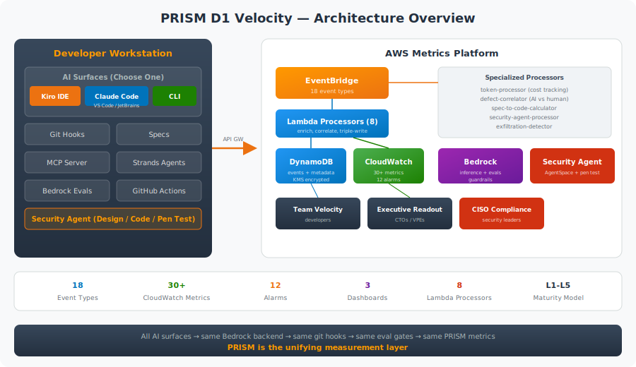

# PRISM D1: Velocity — AI Development Lifecycle Workshop

> :warning: **Sample Project — Not Production-Ready**
>
> This project is provided as a sample and reference implementation only. It is not designed, tested, or hardened for production use. Use it as a starting point or learning resource, and perform your own security review, testing, and operational hardening before deploying to any production environment. See **[SECURITY.md](SECURITY.md)** for known gaps and production hardening guidance.

> Compress the idea-to-production loop with disciplined AI adoption.

Part of the PRISM Framework (Progressive Readiness Index for Scalable Maturity) — the D1 Velocity pillar focuses on AI-native software development lifecycle practices that are **measurable from Day 1**.

## Architecture



## What This Repo Contains

### For Engineering Leaders (Top-Down Visibility)

- **[Executive Readout Dashboard](docs/dashboard-executive.html)** ([spec](docs/data-architecture.md#cloudwatch-executive-readout-prism-d1-executive-readout)) — PRISM level, DORA summary, AI contribution trends, security & compliance posture, cost intelligence
- **[CISO Compliance Dashboard](docs/data-architecture.md#cloudwatch-ciso-compliance-prism-d1-ciso-compliance)** — Security posture, AI code risk profile, shift-left effectiveness, remediation SLA tracking
- **[PRISM Level Tracker](docs/data-architecture.md#quicksight-prism-level-tracker)** (QuickSight) — Maturity progression by team, radar chart of sub-dimensions, benchmarks by funding stage
- **[AI-DORA Analysis](docs/data-architecture.md#quicksight-ai-dora-analysis)** (QuickSight) — Deep-dive exploratory analysis across teams, repos, and AI tools
- **Enhanced DORA metrics** with 6 AI-specific dimensions (acceptance rate, AI-to-merge ratio, eval gate pass rate, spec-to-code hours, post-merge defect rate, AI test coverage delta)
- **[Executive readout templates](docs/leader-guide/executive-readout-template.md)** connecting engineering metrics to business outcomes

### For Engineering Teams (Bottom-Up Activation)

- **[Team Velocity Dashboard](docs/dashboard-team.html)** ([spec](docs/data-architecture.md#cloudwatch-team-velocity-prism-d1-team-velocity)) — Real-time DORA metrics, eval gate quality by rubric, guardrail safety, MCP tool governance, cost per commit, AI vs human defect rates, Security Agent findings
- **4-hour workshop** (+ extensions) with hands-on exercises using Claude Code, Kiro, and Bedrock
- **Spec-driven development** templates with [AI-DLC steering files](bootstrapper/aidlc-steering/) (adapted from [awslabs/aidlc-workflows](https://github.com/awslabs/aidlc-workflows))
- **AI agent development** — Strands SDK, MCP with [scope-based auth](sample-app/src/mcp/auth/), Amazon Bedrock AgentCore
- **[AWS Security Agent integration](bootstrapper/security-agent/)** — design review, code review, pen testing ([setup guide](bootstrapper/security-agent/SETUP-GUIDE.md))
- **Bootstrapper code** — git hooks, CI workflows, eval harnesses, agent configs teams inherit on day one

### For Security Leaders (Governance & Compliance)

- **Bedrock Guardrails** — content filters, PII protection, denied topics with per-trigger metrics
- **MCP Authorization** — scope-based tool access control with audit trail
- **Eval Gates** — 5 rubrics (code-quality, API, security, agent, spec-compliance) + Security Agent finding gate
- **KMS encryption** on all data stores, VPC isolation, exfiltration detection
- **11 CloudWatch alarms** including security critical finding and remediation SLA

## Quick Start

### Prerequisites

Install the PRISM CLI and the codeburn dependency globally:

```bash
npm install -g @prism-d1/cli codeburn
```

This installs `prism-cli` (assessment + bootstrapper) and `codeburn` (AI token tracker for git hooks). Then verify your setup:

```bash
prism-cli workshop verify-setup
```

Or install manually:

- AWS Account with Bedrock access (Claude models enabled)
- Node.js 22+ and npm
- Python 3.11+ (for Strands Agent)
- AWS CLI v2 and CDK v2 (`npm install -g aws-cdk`)
- Claude Code CLI configured for Bedrock (`export CLAUDE_CODE_USE_BEDROCK=1`)
- Git 2.40+, jq, GitHub CLI

The setup script supports flags:
- `--skip-aws` — skip AWS credential and Bedrock checks (for offline prep)
- `--skip-kiro` — skip Kiro IDE check
- `--verify-only` — only verify, don't install anything

### Deploy the Metrics Platform

```bash
cd infra
npm install
npx cdk bootstrap   # First time only
npx cdk deploy --all
```

This deploys: EventBridge bus, 8 Lambda processors, DynamoDB tables (KMS-encrypted), 3 CloudWatch dashboards, 11 alarms, Bedrock Guardrails, model pricing table.

> **For Security Agent:** Add `--context enableSecurityAgent=true` or use `prism-cli securityagent setup`. See the [Security Agent Setup Guide](bootstrapper/security-agent/SETUP-GUIDE.md).

#### VPC Configuration

By default, all Lambda functions deploy into a VPC with private isolated subnets and VPC endpoints (DynamoDB, EventBridge, CloudWatch, KMS, Bedrock Runtime) for network isolation. This adds ~$35-50/month in endpoint costs.

| Option | Command | Use Case |
|--------|---------|----------|
| **New VPC** (default) | `npx cdk deploy --all` | Production — full network isolation |
| **Skip VPC** | `npx cdk deploy --all -c skipVpc=true` | Workshop/demo — saves cost, faster cold starts |
| **Existing VPC** | `npx cdk deploy --all -c vpcId=vpc-0123456789abcdef0` | Enterprise — use shared VPC with existing endpoints or NAT |

When using an existing VPC, ensure it has either VPC endpoints for the required services or a NAT gateway for outbound internet access.

### Assess a Customer

#### Web Assessment Tool (Recommended)

The prism-cli includes a local web interface for running the full assessment flow — scan, interview, and report generation — in a browser.

```bash
prism-cli assessment web
# Opens http://localhost:3120
```

The web tool supports two workflows:

**Self-service (customer runs it themselves):**
1. Customer installs `npm install -g @prism-d1/cli` and runs `prism-cli assessment web`
2. Scans their own repository from the web UI
3. Exports the scan results as JSON and sends the file to you
4. Optionally completes the interview themselves and sends the final HTML report

**SA-led (you run it):**
1. Import the customer's scan JSON into the web UI (skip re-scanning)
2. Conduct the interview using the built-in guide with scoring rubrics
3. Generate the HTML report directly in the browser

**AI Agent interview:**
1. After scanning (or importing a scan), choose "AI Agent Interview" from the next steps
2. An AI agent conducts the 20-question interview conversationally, asks follow-up probes, and scores responses against the rubrics automatically
3. The agent uses context from prior answers to ask smarter questions and avoid repetition
4. When complete, generates the same assessment report as the manual flow

The AI agent requires **Amazon Bedrock access** — specifically the `us.anthropic.claude-sonnet-4-6` model (Claude Sonnet 4.6 via cross-region inference). To set this up:
- Enable model access in the [Bedrock console](https://console.aws.amazon.com/bedrock/home#/modelaccess) (Anthropic → Claude Sonnet 4.6)
- Configure AWS credentials locally (`aws configure`, SSO, or environment variables)
- The agent validates Bedrock access on startup and shows setup instructions if anything is missing

The interview form includes the full question bank, scoring rubrics, and scanner-informed focus areas. Reports can be printed or saved as PDF from the browser.

#### Manual Assessment

For a CLI-only or fully manual workflow, run the [PRISM Assessment](assessment/README.md) to determine maturity level and onboarding track. See the [full methodology guide](assessment/ASSESSMENT-GUIDE.md) for scanner logic, interview rubrics, and scoring formulas.

### Run the Workshop

The workshop is hosted on AWS Workshop Studio: [PRISM D1: Velocity Workshop](https://catalog.us-east-1.prod.workshops.aws/workshops/d0a8b037-dfe0-4023-9ce2-f5de32ee4c67/en-US)

### Run the Sample Agent (No AWS Required)

```bash
cd sample-app
npm install && npm run dev          # Start the task API

cd agent
pip install -e ".[dev]"
python scripts/run-demo.py --mock   # Run agent demo with mock model
```

### Adopt the Bootstrapper (Post-Workshop)

```bash
cd ~/your-repo

# Install git hooks (creates .prism/ config directory)
prism-cli bootstrapper install-git-hooks --team-id your-team

# Optional: set custom token/cost bounds (defaults: 1M tokens, $100/commit)
prism-cli bootstrapper install-git-hooks --team-id your-team --max-tokens 500000 --max-cost 50

# Optional: install globally so all future clones get the hook automatically
prism-cli bootstrapper install-git-hooks --team-id your-team --global

# Choose a CLAUDE.md template for your team
cp /path/to/bootstrapper/claude-code/CLAUDE-backend-api.md ./CLAUDE.md
# Or: CLAUDE-frontend.md, CLAUDE-platform.md, CLAUDE-agent.md

# Add GitHub workflows
mkdir -p .github/workflows
cp /path/to/bootstrapper/github-workflows/prism-ai-metrics.yml .github/workflows/
cp /path/to/bootstrapper/github-workflows/prism-eval-gate.yml .github/workflows/
cp /path/to/bootstrapper/github-workflows/prism-agent-eval.yml .github/workflows/
cp /path/to/bootstrapper/github-workflows/prism-dora-weekly.yml .github/workflows/

# Install eval harness
prism-cli bootstrapper install-eval-harness --with-rubrics

# For agent projects:
cp /path/to/bootstrapper/agent-configs/ ./agent-configs/

# For Security Agent:
prism-cli securityagent setup
```

## Commit Metadata (AI Attribution)

The `prepare-commit-msg` git hook automatically injects trailers into every commit message to track AI tool involvement and token usage.

**Trailers injected:**

| Trailer | Example | Description |
|---------|---------|-------------|
| `AI-Origin` | `ai-generated` or `human` | Whether an AI tool was detected |
| `AI-Tool` | `claude-code`, `kiro`, `q-developer` | Which tool was active (omitted for human commits) |
| `AI-Model` | `us.anthropic.claude-sonnet-4-5-20250929-v1:0` | Model used (Claude Code only) |
| `AI-Input-Tokens` | `12450` | Input tokens since last commit (via codeburn) |
| `AI-Output-Tokens` | `3200` | Output tokens since last commit |
| `AI-Cost` | `$0.42` | Estimated cost since last commit |
| `Spec-Ref` | `.kiro/specs/auth.md` | Spec file if staged or declared |

**Tool support:**

| Tool | Detection Method | Status |
|------|-----------------|--------|
| Claude Code | `CLAUDE_CODE_SESSION_ID` env var | ✅ Supported |
| Kiro IDE | `TERM_PROGRAM=kiro` env var | ✅ Supported |
| Kiro CLI | `KIRO_SESSION_ID` env var | ✅ Supported |
| Amazon Q Developer | `Q_DEVELOPER_SESSION` env var | ✅ Supported |
| Cursor | `VSCODE_SHELL_INTEGRATION=1` (agent mode) | 🔜 Planned |
| GitHub Copilot | codeburn session correlation | 🔜 Planned |
| Windsurf | Process tree or codeburn | 🔜 Planned |
| Codex (OpenAI) | Process tree detection | 🔜 Planned |
| Aider | Process tree or codeburn | 🔜 Planned |
| Cline / Roo Code | codeburn session correlation | 🔜 Planned |

Install the hooks globally so all future repos get attribution automatically:

```bash
prism-cli bootstrapper install-git-hooks --team-id your-team --global
```

## Enhanced AI-DORA Metrics

| Metric | Source | L2 Target | L4 Target |
|--------|--------|-----------|-----------|
| Deployment Frequency | GitHub/CodePipeline | Weekly | Daily+ |
| Lead Time for Changes | PR created → deployed | < 1 week | < 1 day |
| Change Failure Rate | Rollback/hotfix ratio | < 15% | < 5% |
| MTTR | Incident → resolution | < 24h | < 1h |
| **AI Acceptance Rate** | Git hooks + Claude Code | >= 30% | >= 55% |
| **AI-to-Merge Ratio** | CI metadata | >= 20% | >= 45% |
| **Spec-to-Code Turnaround** | Spec commit → PR ready | Baseline set | < 2 days |
| **Post-Merge Defect Rate** | Defect correlator + AI origin tag | <= 1.2x human | <= 0.9x |
| **Eval Gate Pass Rate** | Bedrock Evaluations in CI | >= 80% | >= 95% |
| **AI Test Coverage Delta** | Coverage tool + AI origin tag | > 15% | > 40% |

## Workshop Modules

| # | Module | Duration | Key Outcome |
|---|--------|----------|-------------|
| 00 | Prerequisites | 30 min | Environment ready, Bedrock access confirmed |
| 01 | AI-SDLC Foundations | 45 min | Claude Code configured, first AI-assisted commit |
| 02 | Agent Development | 70 min | Strands agent + MCP server (with auth) + multi-agent orchestration |
| 03 | Spec-Driven Development | 45 min | Spec-driven development with Kiro, Claude Code IDE, or Claude Code CLI |
| 04 | Instrumenting AI Metrics | 45 min | Git hooks + CI emitting 18 event types to EventBridge |
| 05 | Eval Gates in CI/CD | 45 min | 5 Bedrock eval rubrics + Security Agent finding gate blocking bad merges |
| 06 | Dashboards & Visibility | 30 min | 3 CloudWatch + 2 QuickSight dashboards live |

Extension exercises: Security Agent design review (+10 min in Module 03), code review (+10 min in Module 05), CISO dashboard walkthrough (+5 min in Module 06).

## PRISM Maturity Levels (D1 Velocity)

| Level | Name | What It Looks Like |
|-------|------|--------------------|
| L1 | Experimental | Ad hoc AI use, no metrics, no shared tooling |
| L2 | Structured | Claude Code + Kiro adopted, acceptance rate tracked in CI |
| L3 | Integrated | Eval gates in pipeline, AI-DORA dashboards live, spec-driven workflow |
| L4 | Orchestrated | Multi-team platform, AI FinOps, governed agent scope, Security Agent |
| L5 | Autonomous | Agents contributing to architecture, >20% autonomous deployments |

## AI Agent Development

| Component | Technology | Location |
|-----------|-----------|----------|
| **Agent Framework** | Strands Agents SDK (Python) | `sample-app/agent/` |
| **Tool Integration** | Model Context Protocol (MCP) with scope-based auth | `sample-app/src/mcp/` |
| **Production Hosting** | Amazon Bedrock AgentCore | `bootstrapper/agent-configs/` |
| **Agent Eval** | Bedrock Evaluations (5 rubrics) | `bootstrapper/eval-harness/rubrics/` |
| **Security** | Bedrock Guardrails + MCP authorization + Security Agent | `infra/lib/constructs/` |
| **Workshop** | Module 02: Agent Development | `workshop/02-agent-development/` |

## Documentation & Resources

| Resource | Description |
|----------|-------------|
| **[Data Architecture & Dashboard Guide](docs/data-architecture.md)** | 9 data sources, 18 event types, 3 CloudWatch + 2 QuickSight dashboards (widget-by-widget guide), 30+ CloudWatch metrics, 11 alarms |
| **[Community Roadmap](docs/ROADMAP.md)** | Prioritized backlog across 9 phases |
| **[Security Agent Setup Guide](bootstrapper/security-agent/SETUP-GUIDE.md)** | 8-step guide: deploy, domain verification, GitHub connection, pen test config, webhook, GitHub variables, verification |
| **[AI-DLC Steering Files](bootstrapper/aidlc-steering/)** | Development workflow rules adapted from [awslabs/aidlc-workflows](https://github.com/awslabs/aidlc-workflows) |
| **[ROI Model](docs/leader-guide/roi-model.md)** | Defensible ROI calculations for CFO conversations |

## License

This project is licensed under the [MIT License](LICENSE).
