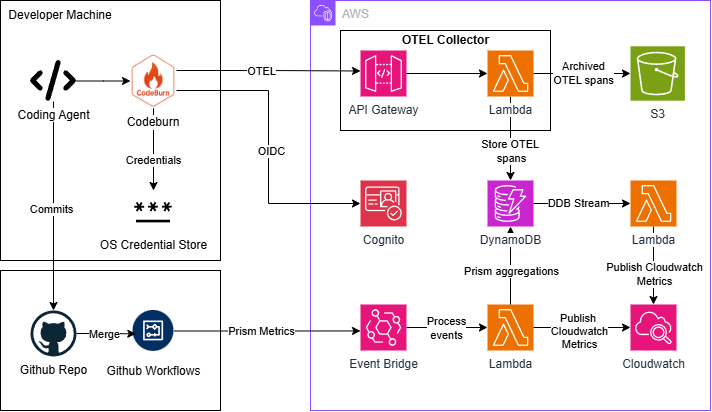
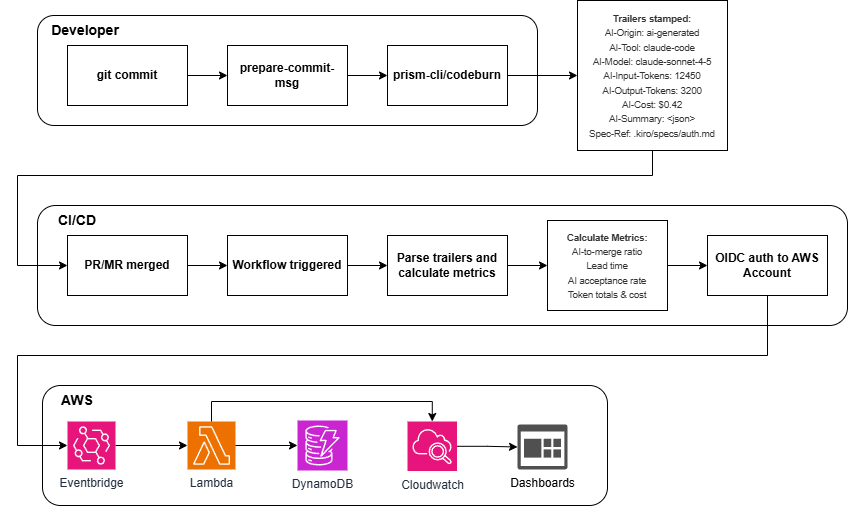

# PRISM D1: Velocity — AI Development Lifecycle Workshop

> :warning: **Sample Project — Not Production-Ready**
>
> This project is provided as a sample and reference implementation only. It is not designed, tested, or hardened for production use. Use it as a starting point or learning resource, and perform your own security review, testing, and operational hardening before deploying to any production environment. See **[SECURITY.md](SECURITY.md)** for known gaps and production hardening guidance.

> Compress the idea-to-production loop with disciplined AI adoption.

Part of the PRISM Framework (Progressive Readiness Index for Scalable Maturity) — the D1 Velocity pillar focuses on AI-native software development lifecycle practices that are **measurable from Day 1**.

## Architecture



## What This Repo Contains

### For Engineering Leaders (Top-Down Visibility)

- **[Executive Readout Dashboard](docs/dashboard-executive.html)** ([spec](docs/data-architecture.md#cloudwatch-executive-readout-prism-d1-executive-readout)) — PRISM level, DORA summary, AI contribution trends, security & compliance posture, cost intelligence
- **[CISO Compliance Dashboard](docs/data-architecture.md#cloudwatch-ciso-compliance-prism-d1-ciso-compliance)** — Security posture, AI code risk profile, shift-left effectiveness, remediation SLA tracking
- **[Enhanced DORA metrics](#enhanced-ai-dora-metrics)** with 6 AI-specific dimensions — acceptance rate, AI-to-merge ratio, eval gate pass rate, and post-merge defect rate work today; spec-to-code turnaround and AI test coverage delta have no emitter yet
- **[Executive readout templates](docs/leader-guide/executive-readout-template.md)** connecting engineering metrics to business outcomes

### For Engineering Teams (Bottom-Up Activation)

- **[Team Velocity Dashboard](docs/dashboard-team.html)** ([spec](docs/data-architecture.md#cloudwatch-team-velocity-prism-d1-team-velocity)) — Delivery health in 8 rows: delivery KPIs, AI-DORA KPIs, contribution/quality trends, per-repo breakdown, eval gates, governance, agents, and security with remediation SLA. Panels read the events table and attribution store directly (full 365-day history; empty panels name the missing emitter), with native graphs for attribution-fed trends. Delivery KPIs are labeled as proxies — merge frequency, PR cycle time, revert rate — until real deploy/incident integrations exist.
- **Developer Productivity Dashboard** (`PRISM-D1-Developer-Productivity`) — Org and per-developer AI output and spend, fed entirely by codeburn attribution (no CI instrumentation or git hooks). Org KPIs and daily trends, plus a per-developer comparison table and a by-tool/by-model spend detail panel scoped by the **Developer** variable.
- **4-hour workshop** (+ extensions) with hands-on exercises using Claude Code, Kiro, and Bedrock
- **Spec-driven development** templates with [AI-DLC steering files](bootstrapper/aidlc-steering/) (adapted from [awslabs/aidlc-workflows](https://github.com/awslabs/aidlc-workflows))
- **AI agent development** — Strands SDK, MCP with [scope-based auth](sample-app/src/mcp/auth/), Amazon Bedrock AgentCore
- **[AWS Security Agent integration](bootstrapper/security-agent/)** — design review, code review, pen testing ([setup guide](bootstrapper/security-agent/SETUP-GUIDE.md))
- **Bootstrapper code** — git hooks, CI workflows, eval harnesses, agent configs teams inherit on day one

### For Security Leaders (Governance & Compliance)

- **Bedrock Guardrails** — content filters, PII protection, denied topics with per-trigger metrics
- **MCP Authorization** — scope-based tool access control with audit trail
- **Eval Gates** — agentic code review via kiro-cli headless (default) or 5 Bedrock rubrics (legacy), + Security Agent finding gate
- **KMS encryption** on all data stores, VPC isolation, exfiltration detection
- **11 CloudWatch alarms** including security critical finding and remediation SLA

## Quick Start

### Administrator Setup (per org)

These steps are performed once by an engineering leader or platform team to provision shared infrastructure.

> **⚠️ Node.js 22 is required.** [codeburn](https://github.com/getagentseal/codeburn) requires Node.js 22 or later for AI usage telemetry collection. Install or upgrade via [nodejs.org](https://nodejs.org/en/download), or use [nvm](https://github.com/nvm-sh/nvm#installing-and-updating): `nvm install 22 && nvm use 22`.

```bash
node --version  # Verify: must be v22.x or later
npm install -g @prism-d1/cli codeburn
```

Requires [AWS CLI v2](https://docs.aws.amazon.com/cli/latest/userguide/getting-started-install.html), CDK v2 (`npm install -g aws-cdk`).

#### 1. Deploy AWS Infrastructure

```bash
cd infra
npm install
npx cdk bootstrap   # First time only
npx cdk deploy --all
```

This deploys: EventBridge bus, 8 Lambda processors, DynamoDB tables (KMS-encrypted), 4 CloudWatch dashboards, 11 alarms, Bedrock Guardrails, model pricing table, and the OTEL collector (Cognito user pool + API Gateway + S3 archive).

> **Skip VPC for demos:** Add `-c skipVpc=true` to save ~$35-50/month. See [VPC Configuration](#vpc-configuration) below.

> **Skip OTEL collector:** Add `-c skipOtelCollector=true` if you only want git-hook-based metrics without per-developer AI usage telemetry.

> **For Security Agent:** Add `--context enableSecurityAgent=true` or use `prism-cli securityagent setup`. See the [Security Agent Setup Guide](bootstrapper/security-agent/SETUP-GUIDE.md).

#### 2. Set Up OIDC (CI/CD → AWS Authentication)

**GitHub:**
```bash
prism-cli bootstrapper setup-github-oidc --global
# Creates OIDC provider + IAM role. Add PRISM_METRICS_ROLE_ARN as a GitHub repo secret.
```

**GitLab:**
```bash
prism-cli bootstrapper setup-gitlab-oidc --global
# Creates OIDC provider + IAM role. Add PRISM_METRICS_ROLE_ARN as a CI/CD variable (unprotected).
```

#### 3. Install CI/CD Workflows (per repo)

**GitHub:**
```bash
prism-cli bootstrapper install-github-workflows --region us-west-2
# Copies workflow files to .github/workflows/
```

**GitLab:**
```bash
prism-cli bootstrapper install-gitlab-workflows --gitlab-url https://gitlab.com --region us-west-2
# Copies workflow files to .prism/gitlab-workflows/
# Then copy or merge .prism/gitlab-workflows/.gitlab-ci.yml into your repo root .gitlab-ci.yml
```

#### 4. Create Developer Accounts

After deploying, create a Cognito user for each developer so they can authenticate with the OTEL collector:

```bash
# Create a user (username MUST be the developer's email)
aws cognito-idp admin-create-user --user-pool-id <OtelUserPoolId output> --username dev@example.com
```

Then share the **OtelCollectorUrl** stack output with your developers — they'll need it for setup below.

**Bring your own IdP** (Okta, Entra ID) instead of Cognito:

```bash
npx cdk deploy --all \
  -c otelIssuer=https://login.example.okta.com/oauth2/default \
  -c otelClientId=0oa1b2c3d4 \
  -c otelIdentityClaim=email
```

Your IdP app must be a **public client with PKCE**, register loopback redirect URIs `http://127.0.0.1:19876/callback` (also ports 19877, 19878), and issue **JWT access tokens** (Okta and Entra ID work; Auth0's opaque access tokens are not supported).

### Developer Setup (per developer)

These steps are run by each developer on their machine. You'll need the **OtelCollectorUrl** from your administrator.

> **⚠️ Node.js 22 is required.** [codeburn](https://github.com/getagentseal/codeburn) requires Node.js 22 or later for AI usage telemetry collection. Install or upgrade via [nodejs.org](https://nodejs.org/en/download), or use [nvm](https://github.com/nvm-sh/nvm#installing-and-updating): `nvm install 22 && nvm use 22`.

#### 1. Install Tools

```bash
node --version  # Verify: must be v22.x or later
npm install -g @prism-d1/cli codeburn
```

#### 2. Set Up AI Usage Telemetry (Codeburn)

```bash
# One command: configures auth, backfills 30 days, installs OS schedule (every 12h)
prism-cli bootstrapper setup-otel-sync --url <OtelCollectorUrl from admin>

# Check status anytime
prism-cli bootstrapper setup-otel-sync --status

# Remove the schedule
prism-cli bootstrapper setup-otel-sync --remove
```

This installs a platform-native schedule (crontab on Linux, LaunchAgent on macOS, Scheduled Task on Windows) that runs `codeburn sync push --since 7d --attribution` every 12 hours. The `--attribution` flag sends git commit attribution data (repo, SHA, merge/revert status) alongside usage telemetry, powering the Developer Productivity dashboard without requiring git hooks or CI instrumentation. The 7-day overlap window means a developer's machine can be off for a week and nothing is missed — duplicate pushes are server-side no-ops. Use `--interval <hours>` to override the cadence.

#### 3. Install Git Hooks (optional)

> **Note:** Git hooks are optional and will be deprecated in a future release. The OTEL sync in step 2 above provides the same metrics (and more) via codeburn. Git hooks remain available for teams that want commit-level AI attribution trailers in their git history.

```bash
# For all future clones (global template):
prism-cli bootstrapper install-git-hooks --global

# For an existing repo (run inside the repo):
prism-cli bootstrapper install-git-hooks
```

The `--global` flag sets `init.templateDir` so all future `git clone` / `git init` automatically get the hooks. Existing repos need a one-time in-repo install.

#### VPC Configuration

By default, all Lambda functions deploy into a VPC with private isolated subnets and VPC endpoints (DynamoDB, EventBridge, CloudWatch, KMS, Bedrock Runtime) for network isolation. This adds ~$35-50/month in endpoint costs.

| Option | Command | Use Case |
|--------|---------|----------|
| **New VPC** (default) | `npx cdk deploy --all` | Production — full network isolation |
| **Skip VPC** | `npx cdk deploy --all -c skipVpc=true` | Workshop/demo — saves cost, faster cold starts |
| **Existing VPC** | `npx cdk deploy --all -c vpcId=vpc-0123456789abcdef0` | Enterprise — use shared VPC with existing endpoints or NAT |

When using an existing VPC, ensure it has either VPC endpoints for the required services or a NAT gateway for outbound internet access.

**Data layout:**

| Destination | Content | Purpose |
|-------------|---------|---------|
| S3 (`prism-d1-otlp-archive-*`) | Raw OTLP JSON batches, partitioned by `dt=` | External contract — Athena, data lake, replay into any OTel backend |
| DynamoDB (`prism-d1-ai-usage`) | Per-span rows (90-day TTL) + daily per-user/tool aggregates | PRISM dashboards |

Duplicate pushes are safe: codeburn's deterministic span IDs act as an idempotency key server-side. Historical sessions are backfilled on first push (aggregates bucket by span date). Running a full ADOT collector for fan-out to X-Ray/Grafana/Datadog is on the [roadmap](docs/ROADMAP.md).

#### Cost Estimate

Monthly cost depends on team size and configuration. All resources are serverless (pay-per-use) except VPC endpoints.

| Component | ~Monthly Cost | Notes |
|-----------|--------------|-------|
| **VPC endpoints** (5×) | $35–50 | Skip with `-c skipVpc=true` |
| **DynamoDB** (2 tables) | $1–5 | On-demand billing; scales with commit volume |
| **Lambda** (8 processors) | $1–3 | Invoked per event; negligible at <50 devs |
| **EventBridge** | < $1 | $1/million events |
| **CloudWatch** (4 dashboards, 11 alarms) | $3–10 | Per-dashboard fee + metric costs |
| **OTEL Collector** (API Gateway + Cognito + S3) | $2–5 | Per-request + S3 storage |
| **Bedrock Guardrails** | $1–5 | Per-invocation; depends on eval gate frequency |
| **KMS** (1 key) | $1 | Fixed monthly fee + $0.03/10K requests |

**Typical total:**
- Workshop/demo (no VPC): **~$10–25/month**
- Production (with VPC, <50 devs): **~$50–80/month**
- Large team (100+ devs, heavy CI): **~$80–150/month**

> 💡 The largest cost driver is VPC endpoints. For workshops and demos, use `-c skipVpc=true` to stay under $25/month.

### Assess a Customer

#### Web Assessment Tool (Recommended)

The prism-cli includes a local web interface for running the full assessment flow — scan, interview, and report generation — in a browser.

```bash
prism-cli assessment web
# Opens http://localhost:3120
```

The web tool supports two workflows:

**Self-service (customer runs it themselves):**
1. Customer installs `npm install -g @prism-d1/cli` and runs `prism-cli assessment web`
2. Scans their own repository from the web UI
3. Exports the scan results as JSON and sends the file to you
4. Optionally completes the interview themselves and sends the final HTML report

**SA-led (you run it):**
1. Import the customer's scan JSON into the web UI (skip re-scanning)
2. Conduct the interview using the built-in guide with scoring rubrics
3. Generate the HTML report directly in the browser

**AI Agent interview:**
1. After scanning (or importing a scan), choose "AI Agent Interview" from the next steps
2. An AI agent conducts the 20-question interview conversationally, asks follow-up probes, and scores responses against the rubrics automatically
3. The agent uses context from prior answers to ask smarter questions and avoid repetition
4. When complete, generates the same assessment report as the manual flow

The AI agent requires **Amazon Bedrock access** — specifically the `us.anthropic.claude-sonnet-4-6` model (Claude Sonnet 4.6 via cross-region inference). To set this up:
- Enable model access in the [Bedrock console](https://console.aws.amazon.com/bedrock/home#/modelaccess) (Anthropic → Claude Sonnet 4.6)
- Configure AWS credentials locally (`aws configure`, SSO, or environment variables)
- The agent validates Bedrock access on startup and shows setup instructions if anything is missing

The interview form includes the full question bank, scoring rubrics, and scanner-informed focus areas. Reports can be printed or saved as PDF from the browser.

#### Manual Assessment

For a CLI-only or fully manual workflow, run the [PRISM Assessment](assessment/README.md) to determine maturity level and onboarding track. See the [full methodology guide](assessment/ASSESSMENT-GUIDE.md) for scanner logic, interview rubrics, and scoring formulas.

### Run the Workshop

The workshop is hosted on AWS Workshop Studio: [PRISM D1: Velocity Workshop](https://catalog.us-east-1.prod.workshops.aws/workshops/d0a8b037-dfe0-4023-9ce2-f5de32ee4c67/en-US)

### Run the Sample Agent (No AWS Required)

```bash
cd sample-app
npm install && npm run dev          # Start the task API

cd agent
pip install -e ".[dev]"
python scripts/run-demo.py --mock   # Run agent demo with mock model
```

## Commit Metadata (AI Attribution)



The `prepare-commit-msg` git hook automatically injects trailers into every commit message to track AI tool involvement and token usage.

**Trailers injected:**

| Trailer | Example | Description |
|---------|---------|-------------|
| `AI-Origin` | `ai-generated` or `human` | Whether an AI tool was detected |
| `AI-Tool` | `claude-code`, `kiro`, `q-developer` | Which tool was active (omitted for human commits) |
| `AI-Model` | `us.anthropic.claude-sonnet-4-5-20250929-v1:0` | Model used (Claude Code only) |
| `AI-Input-Tokens` | `12450` | Input tokens since last commit (via codeburn) |
| `AI-Output-Tokens` | `3200` | Output tokens since last commit |
| `AI-Cost` | `$0.42` | Estimated cost since last commit |
| `Spec-Ref` | `.kiro/specs/auth.md` | Spec file if staged or declared |

**Tool support:**

| Tool | Detection Method | Status |
|------|-----------------|--------|
| Claude Code | `CLAUDE_CODE_SESSION_ID` env var | ✅ Supported |
| Kiro IDE | `TERM_PROGRAM=kiro` env var | ✅ Supported |
| Kiro CLI | `KIRO_SESSION_ID` env var | ✅ Supported |
| Amazon Q Developer | `Q_DEVELOPER_SESSION` env var | ✅ Supported |
| Cursor | `VSCODE_SHELL_INTEGRATION=1` (agent mode) | 🔜 Planned |
| GitHub Copilot | codeburn session correlation | 🔜 Planned |
| Windsurf | Process tree or codeburn | 🔜 Planned |
| Codex (OpenAI) | Process tree detection | 🔜 Planned |
| Aider | Process tree or codeburn | 🔜 Planned |
| Cline / Roo Code | codeburn session correlation | 🔜 Planned |

Install the hooks globally so all future repos get attribution automatically:

```bash
prism-cli bootstrapper install-git-hooks --team-id your-team --global
```

## Enhanced AI-DORA Metrics

The four classic DORA metrics plus six AI-specific dimensions. **Source** is what actually computes each metric today, and **Status** flags where the pipeline is incomplete — several DORA metrics are proxies, and two AI dimensions have no emitter yet.

| Metric | Source | Status | L2 Target | L4 Target |
|--------|--------|--------|-----------|-----------|
| Deployment Frequency | Merged PRs/day (`prism-ai-metrics.yml` fires on PR merge) | ⚠️ Proxy — no deploy integration | Weekly | Daily+ |
| Lead Time for Changes | PR created → **merged** | ⚠️ Proxy — deploy latency not measured | < 1 week | < 1 day |
| Change Failure Rate | % of merged PRs titled `revert\|hotfix\|rollback` | ⚠️ Proxy — heuristic, misses untitled failures | < 15% | < 5% |
| MTTR | Revert/hotfix PR open → merge | ⚠️ Proxy — no incident events emitted | < 24h | < 1h |
| **AI Acceptance Rate** | Git trailers + GitHub PR review API (CI) | ✅ Works; stays CI-fed after hook removal | >= 30% | >= 55% |
| **AI-to-Merge Ratio** | codeburn attribution spans (+ CI line from trailers) | ✅ Works, hook-free | >= 20% | >= 45% |
| **Post-Merge Defect Rate** | Reverted / merged AI commits (attribution) | ✅ Works, hook-free | <= 1.2x human | <= 0.9x |
| **Eval Gate Pass Rate** | kiro-cli headless review in CI | ✅ Works | >= 80% | >= 95% |
| **Spec-to-Code Turnaround** | Requires `Spec-Ref` on commits | ❌ No emitter — the hook doesn't inject the trailer, and attribution spans carry no spec reference | Baseline set | < 2 days |
| **AI Test Coverage Delta** | Requires a coverage tool wired to AI origin | ❌ No emitter — not implemented in any workflow | > 15% | > 40% |

The ✅ rows all survive the [git-hook removal](#3-install-git-hooks-optional) — they come from codeburn attribution or the GitHub API rather than commit trailers.

## Workshop Modules

| # | Module | Duration | Key Outcome |
|---|--------|----------|-------------|
| 00 | Prerequisites | 30 min | Environment ready, Bedrock access confirmed |
| 01 | AI-SDLC Foundations | 45 min | Claude Code configured, first AI-assisted commit |
| 02 | Agent Development | 70 min | Strands agent + MCP server (with auth) + multi-agent orchestration |
| 03 | Spec-Driven Development | 45 min | Spec-driven development with Kiro, Claude Code IDE, or Claude Code CLI |
| 04 | Instrumenting AI Metrics | 45 min | Git hooks + CI emitting 18 event types to EventBridge |
| 05 | Eval Gates in CI/CD | 45 min | Agentic kiro-cli code review (or legacy Bedrock rubrics) + Security Agent finding gate blocking bad merges |
| 06 | Dashboards & Visibility | 30 min | 4 CloudWatch dashboards live |

Extension exercises: Security Agent design review (+10 min in Module 03), code review (+10 min in Module 05), CISO dashboard walkthrough (+5 min in Module 06).

## PRISM Maturity Levels (D1 Velocity)

| Level | Name | What It Looks Like |
|-------|------|--------------------|
| L1 | Experimental | Ad hoc AI use, no metrics, no shared tooling |
| L2 | Structured | Claude Code + Kiro adopted, acceptance rate tracked in CI |
| L3 | Integrated | Eval gates in pipeline, AI-DORA dashboards live, spec-driven workflow |
| L4 | Orchestrated | Multi-team platform, AI FinOps, governed agent scope, Security Agent |
| L5 | Autonomous | Agents contributing to architecture, >20% autonomous deployments |

## AI Agent Development

| Component | Technology | Location |
|-----------|-----------|----------|
| **Agent Framework** | Strands Agents SDK (Python) | `sample-app/agent/` |
| **Tool Integration** | Model Context Protocol (MCP) with scope-based auth | `sample-app/src/mcp/` |
| **Production Hosting** | Amazon Bedrock AgentCore | `bootstrapper/agent-configs/` |
| **Agent Eval** | kiro-cli headless review + Bedrock rubrics (legacy) | `bootstrapper/eval-harness/` |
| **Security** | Bedrock Guardrails + MCP authorization + Security Agent | `infra/lib/constructs/` |
| **Workshop** | Module 02: Agent Development | `workshop/02-agent-development/` |

## Documentation & Resources

| Resource | Description |
|----------|-------------|
| **[Data Architecture & Dashboard Guide](docs/data-architecture.md)** | 9 data sources, 18 event types, 4 CloudWatch dashboards (widget-by-widget guide), 30+ CloudWatch metrics, 11 alarms |
| **[Community Roadmap](docs/ROADMAP.md)** | Prioritized backlog across 9 phases |
| **[Security Agent Setup Guide](bootstrapper/security-agent/SETUP-GUIDE.md)** | 8-step guide: deploy, domain verification, GitHub connection, pen test config, webhook, GitHub variables, verification |
| **[AI-DLC Steering Files](bootstrapper/aidlc-steering/)** | Development workflow rules adapted from [awslabs/aidlc-workflows](https://github.com/awslabs/aidlc-workflows) |
| **[ROI Model](docs/leader-guide/roi-model.md)** | Defensible ROI calculations for CFO conversations |

## License

This project is licensed under the [MIT License](LICENSE).
