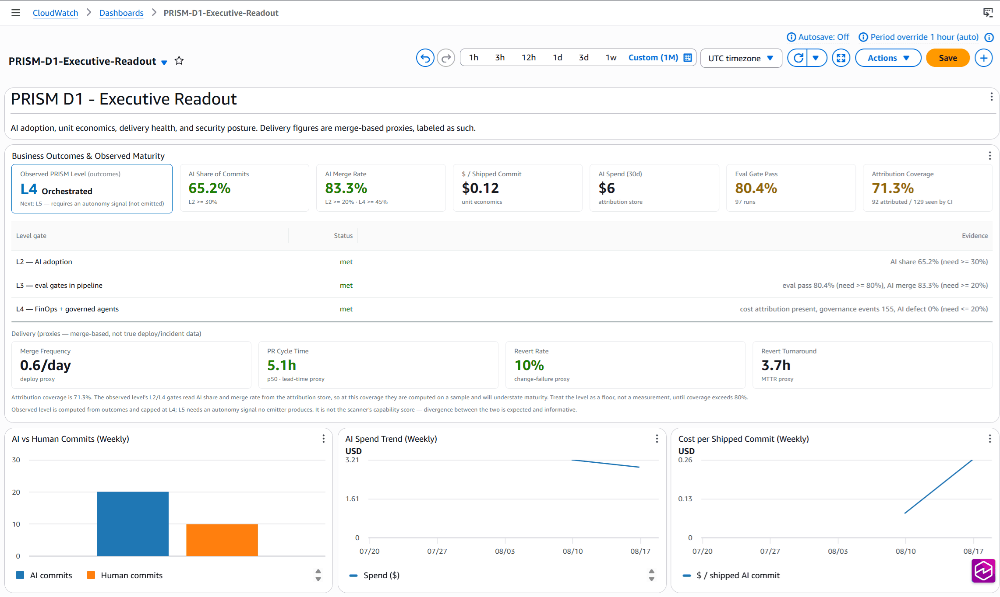

# PRISM D1: Velocity — AI Development Lifecycle Workshop

> :warning: **Sample Project — Not Production-Ready**
>
> This project is provided as a sample and reference implementation only. It is not designed, tested, or hardened for production use. Use it as a starting point or learning resource, and perform your own security review, testing, and operational hardening before deploying to any production environment. See **[SECURITY.md](SECURITY.md)** for known gaps and production hardening guidance.

> Compress the idea-to-production loop with disciplined AI adoption.

Part of the PRISM Framework (Progressive Readiness Index for Scalable Maturity) — the D1 Velocity pillar focuses on AI-native software development lifecycle practices that are **measurable from Day 1**.

PRISM D1 instruments how your teams actually use AI to write software — which commits AI wrote, whether that code passes review and survives in production, and what it costs — then renders it on dashboards aimed at engineers, engineering leaders, and CISOs.



*The Executive Readout, running on real data. The **observed PRISM level** is computed from live outcome metrics rather than self-assessed, with a gate table naming what blocks the next level. AI share, merge rate and cost per shipped commit come from commit attribution — and **Attribution Coverage** reports what fraction of the fleet those numbers actually cover, so a partially-onboarded team is never mistaken for a partially-AI one.*

## Architecture


## Quick Start

> **⚠️ Node.js 22 is required.** [codeburn](https://github.com/getagentseal/codeburn) needs Node.js 22+ for AI usage telemetry. Install via [nodejs.org](https://nodejs.org/en/download) or [nvm](https://github.com/nvm-sh/nvm#installing-and-updating): `nvm install 22 && nvm use 22`.

Also requires [AWS CLI v2](https://docs.aws.amazon.com/cli/latest/userguide/getting-started-install.html) and CDK v2 (`npm install -g aws-cdk`).

### 1. Deploy the infrastructure (once per org)

```bash
node --version                       # must be v22.x or later
npm install -g @prism-d1/cli codeburn

git clone https://github.com/aws-samples/sample-prism-d1-velocity.git
cd sample-prism-d1-velocity/infra
npm install
npx cdk bootstrap                    # first time in this account/region only
npx cdk deploy --all -c skipVpc=true # skipVpc saves ~$35-50/mo; drop it for prod
```

This creates the EventBridge bus, Lambda processors, DynamoDB tables (KMS-encrypted), 4 CloudWatch dashboards, alarms, Bedrock Guardrails, and the OTEL collector. Note the **`OtelCollectorUrl`** and **`OtelUserPoolId`** stack outputs — you need both below.

### 2. Give each developer a telemetry account

```bash
# username MUST be the developer's email
aws cognito-idp admin-create-user \
  --user-pool-id <OtelUserPoolId> \
  --username dev@example.com
```

### 3. Each developer starts syncing (once per machine)

```bash
npm install -g @prism-d1/cli codeburn
prism-cli bootstrapper setup-otel-sync --url <OtelCollectorUrl>
```

One command: authenticates, backfills 30 days, and installs a platform-native schedule (crontab / LaunchAgent / Scheduled Task) that pushes usage **and** git commit attribution every 12 hours. Check it with `--status`, remove it with `--remove`.

### 4. Confirm data is flowing

Open the **PRISM-D1-Team-Velocity** dashboard in CloudWatch. Within one sync cycle you should see AI-vs-human commit counts and an **Attribution Coverage** percentage.

> **Coverage is the number to watch first.** It compares commits your CI observed (a complete census) against commits attribution actually captured (a sample of onboarded machines). Below 80%, every AI metric is understating reality — the fix is getting more developers through step 3, not changing the dashboard.

### Next steps

Wire up CI so delivery metrics and eval gates start reporting:

```bash
prism-cli bootstrapper setup-github-oidc --global      # or setup-gitlab-oidc
prism-cli bootstrapper install-github-workflows --region us-west-2
```

Full instructions for OIDC, per-repo workflows, eval gates, the AWS Continuum security agent, VPC options, and cost tuning are in the **[User Guide](USER_GUIDE.md)**.

## Documentation

| Guide | For | Contents |
|-------|-----|----------|
| **[User Guide](USER_GUIDE.md)** | Engineers deploying PRISM | Setup, CI/CD workflows, eval gates, security agent, dashboards, agent development, troubleshooting |
| **[Data Architecture](docs/DATA-ARCHITECTURE.md)** | Anyone extending it | Data sources, event schema, the attribution pipeline, metrics catalog with known gaps, alarms, dashboard design decisions |
| **[Leader Guide](docs/LEADER_GUIDE.md)** | Engineering leaders | Executive readout template, ROI model, maturity progression |
| **[Assessment Guide](assessment/ASSESSMENT_GUIDE.md)** | Solutions Architects | Scanner categories, interview questions and rubrics, scoring, qualification matrix |
| **[Customer Onboarding](assessment/ONBOARDING.md)** | Solutions Architects | Onboarding tracks, email templates, per-track pre-work |
| **[Roadmap](docs/ROADMAP.md)** | Contributors | Prioritized backlog |

## What This Repo Contains

### Dashboards

Four CloudWatch dashboards, all reading the events table and attribution store directly so full history is available and empty panels name the emitter that is missing.

- **[Team Velocity](docs/DATA-ARCHITECTURE.md#cloudwatch-team-velocity-prism-d1-team-velocity)** — delivery KPIs, AI-DORA KPIs, contribution and quality trends, per-repo breakdown, eval gates, governance, agents, and security with remediation SLA. Delivery figures are labeled as proxies (merge frequency, PR cycle time, revert rate) until real deploy and incident integrations exist.
- **[Executive Readout](docs/DATA-ARCHITECTURE.md#cloudwatch-executive-readout-prism-d1-executive-readout)** — business outcomes and an **observed PRISM level** computed live from outcome metrics, with a gate table showing what blocks the next level. Plus unit economics, AI-vs-human quality, and a condensed security strip.
- **[CISO Compliance](docs/DATA-ARCHITECTURE.md#cloudwatch-ciso-compliance-prism-d1-ciso-compliance)** — exposure and finding aging, per-severity remediation SLA with breaches named, **AI code risk normalized per 100 commits**, shift-left effectiveness with a computed finding survival rate, CWE and compliance-framework coverage, runtime governance.
- **[Developer Productivity](docs/DATA-ARCHITECTURE.md#cloudwatch-developer-productivity-prism-d1-developer-productivity)** — org and per-developer AI output and spend, fed entirely by codeburn attribution with no CI instrumentation or git hooks.

### For Teams

- **~5-hour workshop** (4h40m of modules 01–06, plus 30min prerequisites and optional extensions) using Claude Code, Kiro, and Bedrock
- **Spec-driven development** templates with [AI-DLC steering files](bootstrapper/aidlc-steering/) (adapted from [awslabs/aidlc-workflows](https://github.com/awslabs/aidlc-workflows))
- **AI agent development** — Strands SDK, MCP with [scope-based auth](sample-app/src/mcp/auth/), Amazon Bedrock AgentCore
- **Bootstrapper code** — CI workflows, eval harnesses, agent configs, spec templates teams inherit on day one

### For Security Leaders

- **Bedrock Guardrails** — content filters, PII protection, denied topics with per-trigger metrics
- **MCP Authorization** — scope-based tool access control with audit trail
- **Eval Gates** — agentic code review via kiro-cli headless (default) or 5 Bedrock rubrics (legacy), plus an AWS Continuum finding gate
- **KMS encryption** on all data stores, VPC isolation, exfiltration detection

## Enhanced AI-DORA Metrics

The four classic DORA metrics plus three AI-specific dimensions. **Source** is what actually computes each metric today, and **Status** flags where the pipeline is incomplete — the DORA metrics are currently proxies.

| Metric | Source | Status | L2 Target | L4 Target |
|--------|--------|--------|-----------|-----------|
| Deployment Frequency | Merged PRs/day (`prism-ai-metrics.yml` on PR merge) | ⚠️ Proxy — no deploy integration | Weekly | Daily+ |
| Lead Time for Changes | PR created → **merged**, p50 | ⚠️ Proxy — deploy latency not measured | < 1 week | < 1 day |
| Change Failure Rate | % of merged PRs titled `revert\|hotfix\|rollback` | ⚠️ Proxy — heuristic, misses untitled failures | < 15% | < 5% |
| MTTR | Revert/hotfix PR open → merge | ⚠️ Proxy — no incident events emitted | < 24h | < 1h |
| **AI-to-Merge Ratio** | codeburn attribution spans | ✅ Works, hook-free | >= 20% | >= 45% |
| **Post-Merge Defect Rate** | Reverted / merged AI commits (attribution) | ✅ Works, hook-free | <= 1.2x human | <= 0.9x |
| **Eval Gate Pass Rate** | kiro-cli headless review in CI | ✅ Works | >= 80% | >= 95% |

All four delivery proxies aggregate over the dashboard's selected time range. The ✅ rows come from codeburn attribution rather than git commit trailers, so they survive [git-hook removal](USER_GUIDE.md#git-hooks-deprecated).

## PRISM Maturity Levels (D1 Velocity)

| Level | Name | What It Looks Like |
|-------|------|--------------------|
| L1 | Experimental | Ad hoc AI use, no metrics, no shared tooling |
| L2 | Structured | Claude Code + Kiro adopted, acceptance tracked in CI |
| L3 | Integrated | Eval gates in pipeline, AI-DORA dashboards live, spec-driven workflow |
| L4 | Orchestrated | Multi-team platform, AI FinOps, governed agent scope, security agent |
| L5 | Autonomous | Agents contributing to architecture, >20% autonomous deployments |

The Executive Readout computes an **observed** level from live outcome metrics, capped at L4 — L5 requires an autonomy signal no emitter produces. That is deliberately distinct from the [assessment](assessment/ASSESSMENT_GUIDE.md) scanner's **capability** score, and divergence between the two is informative: capability without outcomes means tooling is installed but unused.

## Run the Workshop

Hosted on AWS Workshop Studio: **[PRISM D1: Velocity Workshop](https://catalog.us-east-1.prod.workshops.aws/workshops/d0a8b037-dfe0-4023-9ce2-f5de32ee4c67/en-US)**

| # | Module | Duration | Key Outcome |
|---|--------|----------|-------------|
| 00 | Prerequisites | 30 min | Environment ready, Bedrock access confirmed |
| 01 | AI-SDLC Foundations | 45 min | Claude Code configured, first AI-assisted commit |
| 02 | Agent Development | 70 min | Strands agent + MCP server with auth + multi-agent orchestration |
| 03 | Spec-Driven Development | 45 min | Spec-driven development with Kiro or Claude Code |
| 04 | Instrumenting AI Metrics | 45 min | CI emitting events to EventBridge |
| 05 | Eval Gates in CI/CD | 45 min | Agentic kiro-cli code review + security finding gate blocking bad merges |
| 06 | Dashboards & Visibility | 30 min | 4 CloudWatch dashboards live |

Extensions: security design review (+10 min, Module 03), code review (+10 min, Module 05), CISO dashboard walkthrough (+5 min, Module 06).

## Assess a Customer

```bash
prism-cli assessment web    # opens http://localhost:3120
```

Scan a repository, run the 20-question interview (manually or with an AI agent via Bedrock), and generate an HTML report. See the **[Assessment Guide](assessment/ASSESSMENT_GUIDE.md)** for methodology and **[Customer Onboarding](assessment/ONBOARDING.md)** for what happens next.

## License

This project is licensed under the [MIT License](LICENSE).
