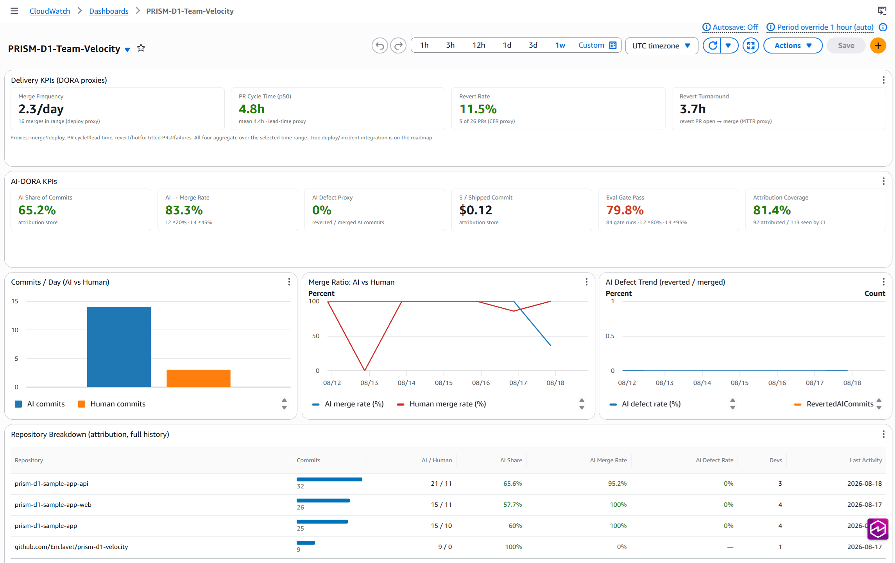
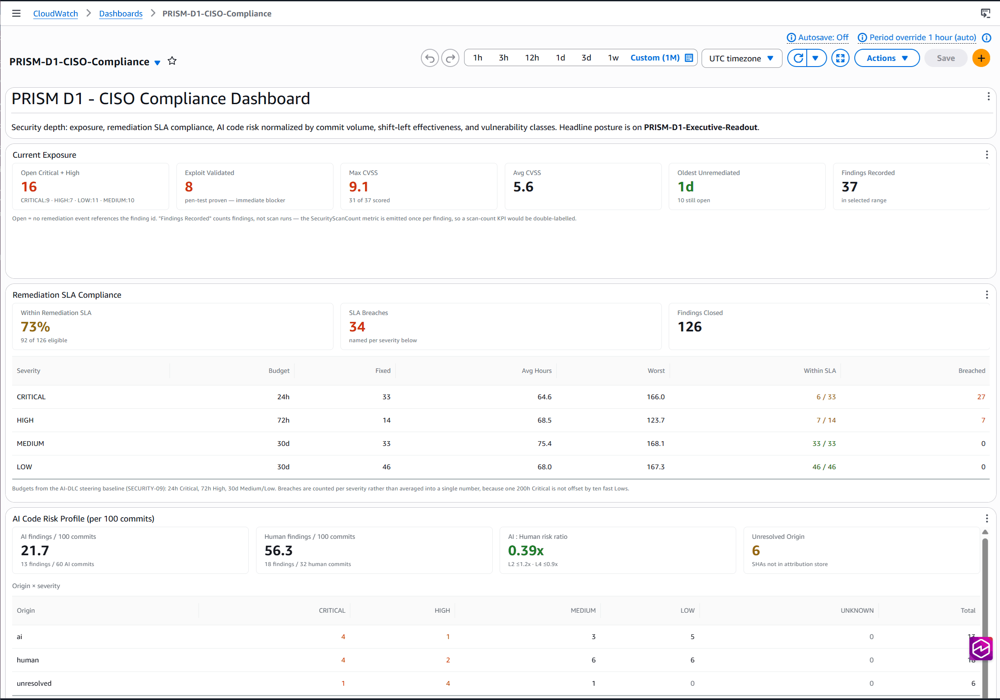
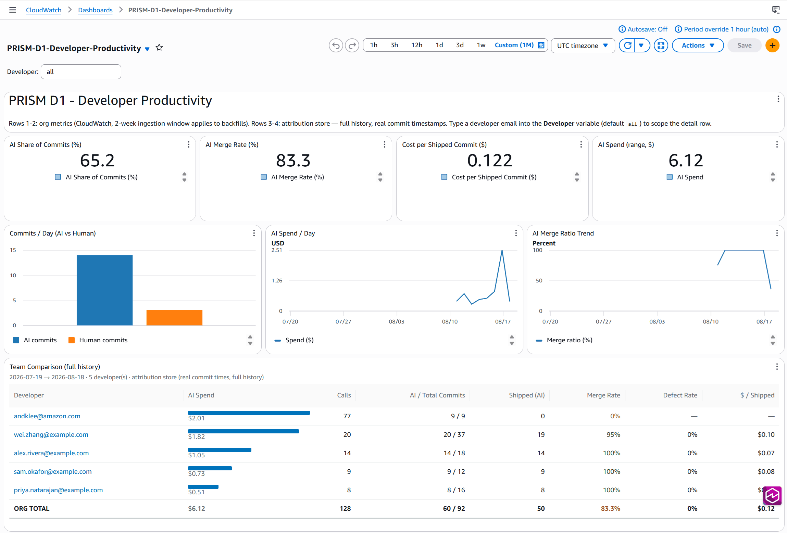

> **Last updated:** 2026-08-16
> **Purpose:** Document how every AI-assisted action becomes a measurable metric — from git commit to executive dashboard.

---

## Overview

**6 working data sources** feed **EventBridge**, processed by **Lambda** (1 core processor + 10 specialized), triple-written to **DynamoDB** (events, team metadata, and AI usage — all KMS-encrypted) and **CloudWatch** (time-series). **18 event types** carry DORA, AI-DORA, cost, security, and quality metrics across the full AI development lifecycle.

The primary source is **codeburn attribution** — OTLP spans recording real LLM API calls. Everything AI-specific (origin, tokens, cost, per-developer output) derives from it. CI supplies the delivery facts and the commit census that attribution is measured against.

Three sources documented in earlier revisions are retired; see [Retired sources](#retired-sources).

---

## End-to-End Data Flow


---

## Data Sources

### 1. codeburn Attribution (primary)

`codeburn` runs on the developer's machine, recording a usage span per LLM API call (model, input/output tokens, estimated cost, `traceId`) and an attribution span per commit. `codeburn sync push --attribution` ships both to the OTEL collector on a ~12-hour schedule installed by `prism-cli bootstrapper setup-otel-sync`.

This is the only source that can distinguish AI-written from human-written code, because it observes actual API calls rather than inferring from which terminal a commit was typed in. See [AI Origin Resolution](#ai-origin-resolution-deferred-attribution-join).

**Coverage is a sample, not a census** — only developers who installed codeburn *and* its sync schedule are represented. That is why every AI metric is reported against an [attribution coverage denominator](#attribution-coverage--the-denominator-every-ai-metric-needs).

### 2. GitHub Actions Workflows

| Workflow | Trigger | Emits |
|----------|---------|-------|
| **prism-ai-metrics.yml** | PR merged to main/master | `prism.d1.pr` + `prism.d1.deploy` — per-PR **facts** only: lead time, `is_failure_fix` label, review verdict counts, commit SHAs, `total_commits`. No rates; the dashboard aggregates at query time. |
| **prism-eval-gate-kiro.yml** | PR opened/updated | `prism.d1.eval` + `prism.d1.security.*` — agentic review result and AWS Continuum findings |
| **prism-agent-eval.yml** | PR touching agent paths | `prism.d1.agent.eval` — agent quality scores via Bedrock rubric |

`prism-ai-metrics.yml` fires on every merge regardless of author, which makes its `total_commits` a repo-complete census — the denominator attribution coverage is measured against.

### 3. Direct API Ingestion

`POST /metrics`, API key + usage plan, 50 req/s burst and 100K/month quota. For custom integrations, third-party CI, and manual submission.

### 4. MCP Tool Call Audit

The MCP server's audit logger emits `prism.d1.mcp.tool_call` for every tool call requiring audit (medium/high risk).

### 5. Agent Runtime Metrics

Agent invocations emit `prism.d1.agent` with step counts, tool calls, tokens, and guardrail triggers. Individual guardrail triggers emit separate `prism.d1.guardrail` events.

### 6. AWS Security Agent

Proactive scanning across three AI-DLC phases:

| Phase | Trigger | What It Scans | Event Type |
|---|---|---|---|
| Design Review | Spec/design doc committed | Architecture decisions, data flows, auth design | `prism.d1.security.design_review` |
| Code Review | PR opened/updated | Source against org security policies | `prism.d1.security.code_review` |
| Pen Testing | Deploy to staging | Running app (OWASP Top 10, business logic) | `prism.d1.security.pen_test` |

Findings arrive via `POST /security-findings` webhook or scheduled polling, enriched with `team_id` and AI origin. `security-remediation-tracker` correlates findings with merged PRs for remediation time; `security-response-automator` raises alarms and eval-gate penalties on Critical/High.

CDK resources: `CfnAgentSpace` (scope + KMS), `CfnTargetDomain` (pen test scope), IAM service role, log group — see `infra/lib/constructs/security-agent-construct.ts`.

### Retired sources

| Source | Status | What replaced it |
|---|---|---|
| **Git hooks** (`bootstrapper/metric-hooks/`) | ⚠️ Deprecated, being removed | codeburn attribution. Hooks inferred AI origin from env vars (`CLAUDE_CODE`, `KIRO_SESSION`, `Q_DEVELOPER_SESSION`) and wrote `AI-Origin` / `AI-Tool` / `AI-Model` trailers — "you were inside an AI tool's terminal", not "an LLM wrote this". `post-commit` / `post-merge` wrote JSON to `.prism/metrics/` and never emitted events. |
| **GitHub webhooks** | ⚠️ Never implemented | `prism-ai-metrics.yml` emits `prism.d1.pr` and `prism.d1.deploy` from CI with OIDC — no self-hosted endpoint or shared secret. A reference handler once lived at `docs/reference/github-webhook-handler/`, was never deployed by CDK, and has been removed. |
| **Bedrock CloudTrail** | ⚠️ Never implemented | codeburn usage spans. The design called for a `token-processor` Lambda, a DynamoDB pricing table with a deploy-time seeder, and an IAM-ARN-to-email identity table. None was built, and none is needed: spans already carry model, token counts, and developer identity. |

Two consequences of the hook removal that are easy to miss:

- **`Spec-Ref` has no replacement.** Anything derived from that trailer (spec-to-code hours, spec coverage) goes dark — attribution spans carry no spec reference, so this needs a new source rather than a rewrite.
- **`prism.d1.commit` has no producer** outside the demo-data generator. Two Lambdas that consumed it, `defect-correlator` and `spec-to-code-calculator`, were deleted as permanent no-ops. Three consumers still reference the detail type and are unreachable: the EventBridge rule in `infra/lib/metrics-pipeline-stack.ts`, the AI-origin branch in `infra/lib/lambda/security-agent-processor.ts`, and the commit query in `infra/lib/lambda/api-handler.ts`.

**Phase 2 is done for the security path.** `prism-eval-gate-kiro.yml` (findings) and `prism-ai-metrics.yml` (PR events feeding remediation) no longer grep trailers — both emit `commit_shas` and origin resolves at render time. There were **two** trailer paths, not one: findings greped trailers directly, while remediation origin came from `ai_context.origin`, itself computed from a trailer-derived `ai_ratio`. Both degraded silently to `human` rather than erroring, so both needed rewiring.

---

## Event Schema

Every event follows this base structure on EventBridge:

```json
{
  "source": "prism.d1.velocity",
  "detail-type": "prism.d1.pr | .deploy | .eval | .agent | .agent.eval | .guardrail | .mcp.tool_call | .security.* | .quality | .assessment",
  "detail": {
    "team_id": "team-alpha",
    "repo": "owner/repo-name",
    "timestamp": "2026-04-22T14:30:00Z",
    "prism_level": 3,
    "metric": {
      "name": "commit.files_changed",
      "value": 5,
      "unit": "files"
    },
    "ai_context": {
      "tool": "claude-code",
      "model": "claude-sonnet-4",
      "session_id": "sess_abc123",
      "origin": "ai-assisted"
    },
    "dora": {
      "deployment_frequency": 1,
      "lead_time_seconds": 3600,
      "is_failure_fix": false
    },
    "ai_dora": {
      "eval_gate_pass_rate": 1.0
    }
  }
}
```

### Extended Event Payloads

| Field | Event Types | Description |
|-------|------------|-------------|
| `pr` | `prism.d1.pr` | PR number, author, review verdict counts, `total_commits`, **commit SHAs** |
| `eval` | `prism.d1.eval` | Eval ID, rubric name, result, score, criterion scores |
| `guardrail` | `prism.d1.guardrail` | Guardrail ID, trigger category/type, action taken, agent name |
| `mcp_tool_call` | `prism.d1.mcp.tool_call` | Session ID, client ID, tool name, scopes, authorized flag, risk level |
| `quality` | `prism.d1.quality` | AI defect rate, human defect rate, AI/human commit counts |
| `security` | `prism.d1.security` | Alert type, table name, principal ARN, read count |
| `security_agent_finding` | `prism.d1.security.{design_review,code_review,pen_test}` | Finding ID, phase, severity, CVSS, category, CWE, exploit validated, compliance mappings, **commit SHAs**, spec ref |
| `security_remediation` | `prism.d1.security.remediation` | Finding ID, severity, remediation time hours, remediated by origin, fix PR number |

---

## AI Origin Resolution: Deferred Attribution Join

AI-vs-human origin is **not** resolved at emit time. Workflows emit the PR's commit SHA list and the join against the attribution store happens when a dashboard panel renders.

### Why not resolve it in CI

The obvious design — have the workflows look up origin and write a verdict onto the event — fails for two independent reasons.

**Auth.** The receiver's API Gateway uses a JWT authorizer (audience = the Cognito client ID) built for codeburn's device flow on developer machines. CI authenticates with an IAM role via OIDC, not a Cognito token, so `curl https://.../v1/attribution` from a workflow returns 401. This one is solvable — CI could direct-invoke the receiver Lambda, the same pattern the widget Lambdas use.

**Timing — the one that actually decides the design.** Attribution spans land when a developer's machine runs `codeburn sync push --attribution`, scheduled every ~12 hours. CI runs at PR merge, often minutes after authoring. A synchronous lookup would frequently find nothing, fall back to `human`, and bake that wrong verdict into an immutable event — reproducing the exact failure being fixed, with a different cause.

| | Resolve in CI | Resolve at render (chosen) |
|---|---|---|
| When | At merge — attribution may not exist yet | At dashboard render — attribution has landed |
| Correctness | Races the 12h sync window | Eventually correct, always |
| CI requires | `lambda:InvokeFunction` + retry logic | Nothing |
| Event carries | A verdict (wrong if early) | Commit SHAs (immutable facts) |
| Backfill | Impossible — event already written | Automatic on next render |

### How it works

1. **Emit** — workflows compute `git rev-list "${BASE_SHA}..${HEAD_SHA}"` (capped at 50 SHAs) and emit it as `commit_shas`. No origin verdict is derived.
2. **Persist** — `metrics-processor.ts` stores `commit_shas` and `pr_number` on the finding / PR payload. Origin-dimensioned metrics are skipped when `ai_origin` is absent rather than defaulting.
3. **Join** — `velocity-widget.ts` `resolveOriginForShas()` calls `GET /v1/attribution` per SHA at render time. The receiver classifies a commit as AI-generated when correlated LLM usage spans share its `traceId`.

A finding from a PR that merged before its author's next sync shows the correct origin the following day, with no reprocessing.

### Origin is frozen at ingest, not re-derived

`writeCommitAttribution` resolves origin once, at write time, and persists `ai_origin` / `ai_tool` / `ai_model` on the `COMMIT#<sha>` item.

This was previously inferred at query time, which was a latent corruption bug: commit facts live `COMMIT_TTL_DAYS` (365) while usage spans — the join target — live `SPAN_TTL_DAYS` (90). On day 91 the join found nothing and every aging AI commit silently reclassified as `human`, making AI adoption appear to decline over time, depressing the observed PRISM level's L2 gate, and skewing the CISO per-100-commits comparison on both sides.

**"Derive at read time" is only sound when the inputs outlive the output.** They don't here, so this one derivation is frozen while its inputs are fresh. Readers prefer the stored verdict and expose `originSource: 'stored' | 'joined'` so a re-derived legacy value is never silently mixed with a frozen one.

### Attribution coverage — the denominator every AI metric needs

Every AI metric is computed from the attribution store, which only sees developers running codeburn **and** its sync schedule. It is a sample of unknown coverage. Without a denominator, a 40%-onboarded team and a genuinely 40%-AI team render identically.

CI supplies the census: `prism-ai-metrics.yml` fires on every merge regardless of author and reports `pr.total_commits`. Attribution supplies the sample. The ratio is surfaced as an **Attribution Coverage** KPI on both the AI-DORA and Executive views, and below 80% the observed PRISM level carries an explicit "treat as a floor" caveat. Coverage is `null` (not 0%) when no CI census exists, since unknowable and zero are different findings.

Coverage is also **forward-looking only** — it sums `pr.total_commits`, and the `pr` section was not persisted before the per-merge workflow refactor, so windows predating it report `null`.

### Three states, not two

| Resolved | Condition |
|---|---|
| `ai` | any commit in the set has correlated usage spans |
| `human` | all commits found in the store, none AI-attributed |
| `unresolved` | no commit SHA found in the store |

`unresolved` is deliberately **not** collapsed into `human`. A missing SHA means "not synced yet, or this author never onboarded codeburn" — treating that as "a human wrote it" is the same class of silent undercount the deferred join exists to eliminate, and it is the failure mode that looks correct.

### Tokens and cost come from the same spans

Origin, token counts, and spend are all derived from one pipeline — there is no separate cost subsystem:

```
AI coding tool (Claude Code / Kiro / Cursor / Q Developer)
         |
         v
codeburn (local: usage spans per LLM call — model, tokens, est. cost, traceId)
         |
         | codeburn sync push --attribution   (every ~12h, per developer)
         v
OTEL collector (Cognito-authenticated OTLP endpoint)
         |
         v
Lambda: otel-receiver
  - Writes SPAN# items (usage) and COMMIT# items (attribution)
  - Joins commit -> usage by traceId AT INGEST and freezes
    ai_origin / ai_tool / ai_model / origin_source onto the commit item
         |
         v
DynamoDB ai-usage table (stream)
         |
         +--> Lambda: otel-metrics-publisher      -> AIInputTokens, AIOutputTokens, AICostUSD
         +--> Lambda: attribution-metrics-publisher -> AICommits, MergedAICommits, RevertedAICommits, ...
         |
         v
Dashboards: Developer Productivity (per-developer output and spend),
            Executive Readout (cost per shipped commit, AI spend by range)
Alarms: BedrockDailyCostHigh (> $100/day on AICostUSD)
```

| Dimension | Status | Detail |
|-----------|--------|--------|
| Tool identity | **Tracked** | `ai_tool`, frozen on the commit item at ingest |
| Model used | **Tracked** | `ai_model` from usage spans |
| Code output | **Tracked** | Lines/files per commit |
| Token consumption | **Tracked** | `AIInputTokens` / `AIOutputTokens` |
| Cost per session | **Tracked** | `AICostUSD`, also by `Tool` and `Model` |
| Cost per commit | **Not tracked** | Would need the unbuilt token-commit correlator. `CostPerShippedCommit` is a range-level aggregate, not per-commit. |
| Developer-level cost | **Tracked** | Keyed on the codeburn user, not an IAM-ARN mapping |

---

## Specialized Lambda Processors

In addition to the core metrics-processor:

| Lambda | Trigger | Output |
|--------|---------|--------|
| `otel-receiver` | OTLP POST from codeburn | `SPAN#` / `COMMIT#` items; origin frozen at ingest |
| `otel-metrics-publisher` | ai-usage DDB stream | `AIInputTokens`, `AIOutputTokens`, `AICostUSD` |
| `attribution-metrics-publisher` | ai-usage DDB stream (`REPO#` / `COMMIT#`) | Commit-outcome metrics |
| `velocity-widget` / `productivity-widget` | Dashboard custom-widget render | Server-rendered HTML panels |
| `exfiltration-detector` | CloudTrail DynamoDB reads (default bus) | `prism.d1.security` when threshold exceeded |
| `security-agent-processor` | `POST /security-findings` or scheduled poll | `prism.d1.security.*` enriched with team_id + AI origin |
| `security-remediation-tracker` | `prism.d1.pr` (merged PRs) | `prism.d1.security.remediation` with fix timing |
| `security-response-automator` | `prism.d1.security.code_review` / `.pen_test` | Eval gate penalty + alarm escalation |

---

## Processing & Storage

`infra/lib/lambda/metrics-processor.ts` does a **triple-write** for every event.

### Write 1: DynamoDB Events Table

| Field | Value | Purpose |
|-------|-------|---------|
| **Table** | `prism-d1-events` | Immutable event log |
| **Partition Key** | `{team_id}#{repo}` | Team+repo scoping |
| **Sort Key** | `{timestamp}` ISO 8601, plus `#{finding_id}` where present | Time-ordered; the discriminator prevents same-timestamp collisions |
| **GSI** | `by-detail-type` (PK: detail_type, SK: sk) | Query by event type across teams |
| **TTL** | 365 days | Auto-expire old events |

> **Why the sort key carries a discriminator.** A PR fixing three findings emits three remediation events all stamped with the same PR merge time. With `sk = timestamp` alone they collided on the primary key and overwrote each other — three findings stored as one, silently. Findings from a single scan sharing a `createdAt` had the same exposure.

### Write 2: DynamoDB Metadata Table

| Field | Value | Purpose |
|-------|-------|---------|
| **Table** | `prism-team-metadata` | Latest snapshot per team/repo |
| **Key** | `team_id` + `repo` | Fast lookup for current state |

### Write 3: CloudWatch Metrics

Published to namespace `PRISM/D1/Velocity`. Dimensions: **TeamId** and **Repository** always; **AIOrigin**, **AgentName**, **RubricName**, **TriggerCategory**, **ToolName**, **Model**, **Developer** where the payload supplies them.

> All metrics are also published **without dimensions** for aggregate queries. See the all-or-nothing warning in the [metrics catalog](#security-metrics).

---

## CloudWatch Metrics Catalog

### DORA Metrics

| Metric Name | Unit | Source |
|------------|------|--------|
| `DeploymentFrequency` | Count | `prism.d1.deploy` events, one per merge from `prism-ai-metrics.yml` |
| `LeadTimeForChanges` | Seconds | `prism.d1.pr` → `dora.lead_time_seconds` (PR created_at → merged_at). The dashboard renders p50 across the selected range. |
| `ChangeFailureRate` | Percent | Derived at query time: share of PRs in range with `dora.is_failure_fix`. The alarm uses `ChangeFailureCount` ÷ `DeploymentFrequency` via metric math. |
| `MTTR` | Seconds | Derived at query time: median `dora.lead_time_seconds` of PRs with `dora.is_failure_fix` in range |

### AI-DORA Metrics

| Metric Name | Unit | Source |
|------------|------|--------|
| `AIAcceptanceRate` | Percent | ⚠️ **Removed.** Its AI gate was trailer-derived, and a review-less PR defaulted to 100% acceptance — rewarding skipped reviews. Raw verdict counts now live on `prism.d1.pr` (`pr.reviews_approved` / `pr.reviews_changes_requested`) for query-time AI-vs-human comparison. |
| `ChangeFailureCount` | Count | Per-merge failure-fix numerator from `prism-ai-metrics.yml`; the CFR alarm divides it by `DeploymentFrequency` via metric math. |
| `AIToMergeRatio` | Percent | ⚠️ **Removed** — had no consumer, and its CI line was trailer-derived. See the note in `infra/lib/lambda/metrics-processor.ts`. AI merge rate is now computed at query time from attribution (`MergedAICommits` / `AICommits`). |
| `EvalGatePassRate` | Percent | `prism-agent-eval.yml`. Note the eval-gate workflows emit `EvalGatePassRateByRubric` and `EvalScore` instead. |
| `PostMergeDefectRate` | Percent | ⚠️ **Removed** — the defect-correlator Lambda that emitted it was deleted as a permanent no-op. The working defect signal is `RevertedAICommits / MergedAICommits` from attribution. |
| `SpecToCodeHours` | Hours | ⚠️ **Not emitted** — needs `Spec-Ref` on commits; the `prepare-commit-msg` hook does not inject it, and attribution spans carry no spec reference. |
| `AITestCoverageDelta` | Percent | ⚠️ **Not emitted** — no workflow computes coverage delta by AI origin. Demo-generator only. |

### Attribution Metrics (codeburn spans — no git hooks required)

Published by `attribution-metrics-publisher` from a DynamoDB stream on `REPO#` / `COMMIT#` items. All are published **dimensionless** (plus a `Tool` dimension where noted), which is why the native dashboard graphs query them without a `dimensionsMap`.

| Metric Name | Unit | Meaning |
|------------|------|---------|
| `CommitsTotal` | Count | All attributed commits |
| `AICommits` | Count | Commits with correlated LLM usage spans (traceId join) |
| `HumanCommits` | Count | Commits with no correlated usage spans |
| `MergedAICommits` | Count | AI commits that reached the main branch (also by `Tool`) |
| `MergedHumanCommits` | Count | Human commits that reached the main branch |
| `RevertedAICommits` | Count | AI commits later reverted — the defect signal |

> **Timestamp clamping.** `PutMetricData` rejects datapoints older than 14 days and silently drops the *entire batch* if any datapoint is invalid. The publisher clamps commit timestamps older than 13 days to ingest time, so a first publish over historical data lands as "today". The DDB-backed dashboard panels are unaffected — they read real commit timestamps.

### Cost & Token Metrics

| Metric Name | Unit | Source |
|------------|------|--------|
| `AIInputTokens` | Count | `otel-metrics-publisher` from codeburn usage spans |
| `AIOutputTokens` | Count | Same as above |
| `AICostUSD` | None (USD) | Same as above. Also published with `Tool` and `Model` dimensions. |
| `BedrockTokensInput` | Count | ⚠️ **Demo-only** — belonged to the unbuilt CloudTrail token pipeline. Use `AIInputTokens`. |
| `BedrockTokensOutput` | Count | ⚠️ **Demo-only** — same. Use `AIOutputTokens`. |
| `BedrockCostUSD` | None (USD) | ⚠️ **Demo-only** — only emitted by `prism-cli workshop generate-demo-data`. Use `AICostUSD`. |
| `CostPerCommit` | None (USD) | ⚠️ **Demo-only** — required the unbuilt token-commit correlator |
| `TokenEfficiency` | None | ⚠️ **Demo-only** — no real emitter computes tokens per line changed |

> **On the demo-only metrics.** Emitted exclusively by `prism-cli workshop generate-demo-data`, so they populate during workshops and stay empty on real deployments (their alarms sit in `INSUFFICIENT_DATA`). Documented so the gap is explicit — they are not wired into any dashboard panel.

### Quality Metrics

| Metric Name | Unit | Source |
|------------|------|--------|
| `PostMergeDefectRateAI` | Percent | ⚠️ **Removed** — emitted by the `defect-correlator` Lambda, which was deleted as a permanent no-op (`prism.d1.commit` has no producer). |
| `PostMergeDefectRateHuman` | Percent | ⚠️ **Removed** — same reason. The working defect signal is `RevertedAICommits` / `MergedAICommits` from attribution, which is hook-free. |

### Agent, Eval, Guardrail & MCP Metrics

| Metric Name | Unit | Source |
|------------|------|--------|
| `AgentInvocationCount` / `AgentStepCount` / `AgentDurationMs` / `AgentTokensUsed` / `AgentToolInvocationCount` / `AgentGuardrailTriggerCount` | Count / ms | Agent runtime events |
| `AgentSuccessRate` | Percent | 100 if success, 0 if failed |
| `EvalGatePassRateByRubric` | Percent | Eval gate workflow, per rubric |
| `EvalScore` | None (0-1) | Eval gate workflow, average score |
| `GuardrailTriggerCount` / `GuardrailBlockCount` / `GuardrailAnonymizeCount` | Count | Agent guardrail events, per category |
| `MCPToolCallCount` / `MCPAuthDeniedCount` / `MCPToolCallDurationMs` | Count / ms | MCP server audit logger |

### Security Metrics

| Metric Name | Unit | Source (all from `security-agent-processor` unless noted) |
|------------|------|--------|
| `ExfiltrationAlertCount` | Count | Exfiltration-detector Lambda |
| `SecurityFindingCount` | Count | dims: Phase, Severity |
| `SecurityCriticalFindingCount` | Count | Critical + High only |
| `SecurityFindingByOrigin` | Count | dims: AIOrigin |
| `SecurityFindingCVSS` | None (0-10) | CVSS per finding |
| `PenTestExploitCount` | Count | Validated exploits |
| `SecurityScanCount` | Count | dims: Phase — see naming caveat below |
| `SecurityRemediationTimeHours` | Count (hours) | Remediation-tracker; dims: Severity, AIOrigin |

> ⚠️ **All-or-nothing dimensions.** `metrics-processor.ts` publishes each metric twice — once with the **full** dimension set and once with **no dimensions** as an aggregate copy. It never publishes a subset. A widget or alarm querying a *partial* set (e.g. `{AIOrigin}` alone, or `{Phase}` alone) matches neither variant and renders empty / sits in `INSUFFICIENT_DATA` — silently, because CloudWatch does not error on a query that matches nothing. Three CISO widgets shipped broken this way. Query either the full set or no dimensions, use a `SEARCH()` expression, or read the events table directly.
>
> `SecurityScanCount` is **emitted once per finding**, not once per scan, despite the name. Do not build a scan-volume widget on it.

---

## Active Alarms

| Alarm | Metric | Threshold | Period | Can fire today? |
|-------|--------|-----------|--------|---|
| Eval Gate Pass Rate Low | EvalGatePassRate | < 70% | 6 hours | Requires `prism-agent-eval.yml` (the eval-gate workflows emit per-rubric metrics, not this one) |
| Change Failure Rate High | metric math: `100 * ChangeFailureCount / DeploymentFrequency` | > 20% | 1 day | Yes — per-merge counters from `prism-ai-metrics.yml` |
| Agent Success Rate Low | AgentSuccessRate | < 80% | 1 hour | Yes — while the sample-app agent runs |
| Guardrail Block Rate High | GuardrailBlockCount | > 50 | 1 hour | Yes — while the sample-app agent runs |
| Bedrock Daily Cost High | AICostUSD | > $100 | 1 day | Yes — repointed from the demo-only `BedrockCostUSD` |
| Exfiltration Alert | ExfiltrationAlertCount | ≥ 1 | 1 hour | Yes — exfiltration-detector Lambda |
| Security Critical Finding | SecurityCriticalFindingCount | ≥ 1 | 1 hour | Yes — Continuum findings via the eval gate |
| Security Remediation SLA | SecurityRemediationTimeHours | avg > 72h | 1 day | Yes — security-remediation-tracker |
| Security Finding Rate High | SecurityFindingCount | > 50 | 6 hours | Yes — Continuum findings |

**9 alarms total.** None have SNS actions wired by default — operators attach notification topics post-deployment (cdk-nag suppressions `AwsSolutions-SNS2/SNS3` document this).

A `TokenEfficiency` alarm was removed: the metric has no emitter, so it sat in `INSUFFICIENT_DATA` permanently. The daily cost alarm was repointed from `BedrockCostUSD` for the same reason.

> **Alarms stay on CloudWatch metrics even where dashboards moved to DynamoDB.** You cannot alarm on a DDB query, so the metrics-processor keeps publishing regardless of which widget type renders the data. Alarms therefore remain subject to the dimension-matching rule above.

---

## Dashboard Guide

PRISM ships **4 CloudWatch dashboards**. Widget inventory is authoritative in `infra/lib/dashboard-stack.ts` and the panel renderers in `infra/lib/lambda/velocity-widget.ts`; this section covers audience, data sourcing, and the design decisions that are not obvious from the code.

### Hybrid architecture: DDB panels + native graphs

Every dashboard mixes two widget types, chosen per panel by where the trustworthy data lives:

| Widget type | Data source | Why |
|---|---|---|
| **Custom widgets** (`velocity-widget` / `productivity-widget` Lambda) | `prism-d1-events` via the `by-detail-type` GSI, plus the attribution store via `otel-receiver` direct invoke | Full 365-day history at real event timestamps. No dimension matching, no 14-day `PutMetricData` clamp, and honest empty states that name the missing emitter instead of rendering a blank graph. |
| **Native graphs** | CloudWatch metrics from the attribution and OTEL publishers | These series are published dimensionless, so plain queries match them, and native graphs give interactive zoom/hover that server-rendered HTML cannot. |

Three consequences worth knowing:

- **Panel access is gated by IAM**, not metric visibility — viewing a custom-widget panel requires `lambda:InvokeFunction` on the widget Lambda.
- **Custom widgets cannot execute JavaScript.** Trend visuals are server-rendered inline SVG sparklines — no Chart.js, no `<canvas>`.
- **Native graph ratios need `FILL`/`IF` guards.** Commit data is sparse, so an unguarded ratio renders `NaN` on empty buckets, and `RevertedAICommits` may not exist at all until the first revert — a metric with zero datums is *missing*, not zero.

### CloudWatch: Team Velocity (`PRISM-D1-Team-Velocity`)

**Audience:** Engineering teams, tech leads, ICs
**Purpose:** Day-to-day delivery health — DORA proxies, AI-DORA quality, eval gates, governance, security. Spend and per-developer output live on Developer Productivity.



| Row | View | Source |
|---|---|---|
| 1 Delivery KPIs | `view=dora` | `prism.d1.deploy`, `.pr`, `.assessment` |
| 2 AI-DORA KPIs | `view=aidora` | Attribution (`GET /v1/productivity`) + `prism.d1.eval`, with L2/L4 target coloring and the coverage denominator |
| 3 Contribution & quality trends | native graphs | `AICommits`/`HumanCommits`, merge-ratio dual line, defect trend |
| 4 Repository breakdown | `view=repos` | Attribution (`GET /v1/repos`) |
| 5 Eval gates | `view=eval` | `prism.d1.eval`, rubric names **auto-discovered from the data** |
| 6 Governance | `view=governance` | `prism.d1.guardrail`, `.mcp.tool_call` |
| 7 Agent operations | `view=agents` | `prism.d1.agent` |
| 8 Security & remediation SLA | `view=security` | `prism.d1.security.*` + `.remediation` |

**The four delivery KPIs are proxies, and say so on the dashboard.** Merge Frequency is a deploy proxy — `prism.d1.deploy` fires on PR merge with a hardcoded `deployment_frequency: 1`; there is no CodePipeline or GitHub Deployments integration. PR Cycle Time is a lead-time proxy that does not measure deploy latency. Revert Rate is a change-failure proxy from a title regex (`revert|hotfix|rollback`), missing failures not shipped as titled reverts. Revert Turnaround is an MTTR proxy, not incident→resolution — nothing emits `prism.d1.incident`.

**Rows 6–7 populate only while the sample-app agent and MCP server run** (Module 02). An empty panel on a quiet day is correct, not broken.

**Spend is excluded from row 4 deliberately** — usage rollups are keyed by user/day, not by repo, so per-repo cost cannot be derived without double-counting sessions spanning repos.

**Not on this dashboard:** token/cost widgets (duplicated by Developer Productivity, which reads attribution directly); `TokenEfficiency`, `BedrockCostUSD`, `AITestCoverageDelta` (no real emitter); Spec Coverage (needs `Spec-Ref` trailers, which do not survive hook removal).

### CloudWatch: Executive Readout (`PRISM-D1-Executive-Readout`)

**Audience:** CTOs, VPEs, engineering directors, board members
**Purpose:** Leadership view connecting AI adoption to business outcomes, unit economics, delivery health, and security posture.


Same hybrid architecture, held to a stricter bar because of the audience: **every widget must be backed by a real emitter, units are humanized, and proxies say so in their own label.** An engineer seeing an empty panel shrugs; an exec either concludes the program isn't working or quotes a number that came from demo data.

**Observed PRISM level** is computed live from outcome metrics — *not* the scanner's score:

| | Scanner (`prism-cli assessment`) | Observed (this widget) |
|---|---|---|
| Measures | **Capability** — static repo signals (does `CLAUDE.md` exist, is there a `specs/` dir) | **Outcomes** — is AI code actually shipping, are gates passing, is spend attributed |
| Updates | When someone re-runs a scan | Every dashboard refresh |
| Can be wrong by | Showing L4 while zero AI code ships | Showing L2 while all tooling is configured |

The two disagreeing is expected and informative: capability above observed means tooling is built but unused; observed above capability means AI code ships without matching governance.

Gate thresholds are cumulative — the first failed gate caps the level:

| Level | Gate |
|-------|------|
| L2 Structured | AI share of commits >= 30% |
| L3 Integrated | L2 + eval gate pass >= 80% + AI merge rate >= 20% |
| L4 Orchestrated | L3 + cost attribution present + governance events (MCP or guardrail) > 0 + AI defect rate <= 20% |
| L5 Autonomous | **Not computable.** ">20% autonomous deployments" needs a signal distinguishing autonomous from assisted work; no emitter produces one. The widget caps at L4 rather than fabricating L5. |

A gate table shows which threshold blocks the next level and by how much. When attribution is absent the widget reports **"insufficient data"**, deliberately distinct from L1 — no data means the pipeline isn't reporting, whereas L1 is a real finding.

| Row | View | Contents |
|---|---|---|
| 1–2 Business outcomes & observed maturity | `view=exec` | AI share, merge rate, $/shipped commit, AI spend, eval pass, coverage; delivery proxies in a separate sub-row with humanized units |
| 3 Adoption & cost trends | native graphs, weekly | AI vs human commits; AI spend; **cost per shipped commit** — the ROI narrative, since spend can rise while this falls |
| 4 Quality | native graphs, weekly | Merge rate AI vs human (divergence is the signal); AI defect trend |
| 5 Security & governance posture | `view=exec-security` | Open Critical+High, exploit validated, within SLA, guardrail blocks, MCP denials, exfiltration alerts |

Row 5 replaced a 7-widget security section that duplicated CISO Compliance and contained two near-identical guardrail trend widgets. An exec needs the headline plus a link; CISO Compliance owns the breakdowns.

### CloudWatch: CISO Compliance (`PRISM-D1-CISO-Compliance`)

**Audience:** CISOs, security leaders, compliance officers
**Purpose:** Security **depth** — exposure, remediation SLA, AI code risk normalized by commit volume, shift-left effectiveness, vulnerability classes.



Rows 1–5 are DDB panels rather than metric graphs, because the previous layout used seven metric graphs and **three could never render** — and those three carried the CISO-specific value. Each queried a *partial* dimension set (`{AIOrigin}` alone, or `{Phase}` alone) against an all-or-nothing publisher, so they matched neither the full-set nor the dimensionless variant. Reading the events table sidesteps dimension matching entirely and unlocks two things CloudWatch cannot represent at all (rows 3 and 5).

| Row | View | Contents |
|---|---|---|
| 1 Current exposure | `view=ciso-exposure` | Open Critical+High, exploit validated, max/avg CVSS, oldest unremediated, **Findings Recorded** |
| 2 Remediation SLA | `view=ciso-sla` | Overall %, plus per-severity: budget, fixed, avg hours, worst, within SLA, breached |
| 3 AI code risk profile | `view=ciso-risk` | **Findings per 100 commits by origin** |
| 4 Shift-left effectiveness | `view=ciso-shiftleft` | Findings per phase + computed **Finding Survival Rate** |
| 5 Vulnerability classes | `view=ciso-classes` | Top CWEs, category breakdown, **compliance framework coverage** |
| 6 Runtime governance | native graphs | Guardrail triggers vs blocks, MCP denials, exfiltration alerts |

Four design notes:

**"Findings Recorded", not "Scans Run".** The old KPI was backed by `SecurityScanCount`, which is emitted once per *finding*. A scan-count label on a finding count is a mislabel.

**Row 3 reports a rate, not counts.** The old widget compared raw counts ("AI: 12 findings, human: 8"), meaningless if AI wrote three times the code. This joins findings (events table) to commit volume by origin (attribution store) and reports findings per 100 commits, plus the AI:human ratio against L2 ≤1.2x / L4 ≤0.9x. **No CloudWatch metric can express this** — it spans two datasets. Origin uses the [deferred join](#ai-origin-resolution-deferred-attribution-join), with `unresolved` distinct from `human`.

**Survival rate is computed, not emitted.** It is defined in both steering files and nothing emitted it. Computed here by matching issue classes (`cwe_id`, else `category`) raised at design review against later phases: a class flagged early that reappears was surfaced but not prevented. The panel lists the surviving classes so the number is auditable rather than asserted.

**`compliance_mappings` is a string array** — it cannot be a CloudWatch dimension under any encoding, so it was stored and never displayed until this view existed. Expect sparse category/framework tables on a kiro-only deployment: the kiro gate's inline emission carries only `finding_id`, `phase`, `severity`, `cwe_id` and `commit_shas`; `category`, `compliance_mappings` and `cvss_score` come from the `security-agent-processor` webhook path. The panel says so inline.

### CloudWatch: Developer Productivity (`PRISM-D1-Developer-Productivity`)

**Audience:** Engineering managers, tech leads
**Purpose:** Org and per-developer AI output and spend. **Fed entirely by codeburn attribution — no CI instrumentation or git hooks.**



Created only when the OTEL collector is deployed (default on; skip with `-c skipOtelCollector=true`).

| Row | Contents | Source |
|-----|----------|--------|
| 1 Org KPIs | AI share, AI merge rate, cost per shipped commit, AI spend | CloudWatch metric math, NaN-guarded |
| 2 Org trends | Commits/day (AI vs human), AI spend/day, merge ratio trend | Native graphs |
| 3 Team comparison | Per-developer: spend, calls, AI/total commits, shipped, merge rate, defect rate, $/shipped | `GET /v1/productivity` |
| 4 Detail panel | By-tool and by-model spend for the selected scope | `GET /v1/productivity`, scoped by the `Developer` variable |

**Developer variable.** A `PATTERN`-type dashboard variable (default `all`) literal-replaces a token in the dashboard JSON.

**Rows 1–2 can diverge from rows 3–4 on backfills, and that is expected.** Rows 1–2 read CloudWatch, subject to the 14-day timestamp clamp; rows 3–4 query attribution directly with full history at real commit timestamps.

---

## Key Files Reference

Entry points that are hard to guess. Everything else is discoverable from these.

| Component | Location |
|-----------|----------|
| Core event processor (triple-write) | `infra/lib/lambda/metrics-processor.ts` |
| Event schema + coverage guard | `infra/lib/lambda/event-schema.ts`, `infra/scripts/check-metric-coverage.ts` |
| Attribution ingest (origin frozen here) | `infra/lib/lambda/otel-receiver.ts` |
| Dashboard definitions | `infra/lib/dashboard-stack.ts` |
| Dashboard panel renderers | `infra/lib/lambda/velocity-widget.ts`, `infra/lib/lambda/productivity-widget.ts` |
| Pipeline + alarms + EventBridge rules | `infra/lib/metrics-pipeline-stack.ts` |
| Security agent CDK | `infra/lib/constructs/security-agent-construct.ts` |
| CI metric emitter | `bootstrapper/github-workflows/prism-ai-metrics.yml` |
| Eval gate + Continuum scan | `bootstrapper/github-workflows/prism-eval-gate-kiro.yml` |

`npm run check:metrics` in `infra/` asserts that every metric a dashboard or alarm consumes is actually emitted (hard failure) and reports emitted-but-unconsumed metrics as advisory.
